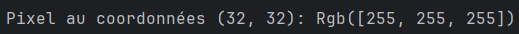

# TP noté Rust

# Partie 1

## Question 2 :

Ce type correspond à une énumération fournie par le package `image`. 
Elle liste tous les types d'images disponibles sur le package.

Pour obtenir une image RGB, il faut utiliser la méthode `.into_rgb8()`.

## Question 3 :

Le canal alpha est conservé si on enregistre l'image de sortie en PNG sauf si on utilise la méthode `.into_rgb8()` ou toute autre méthode qui convertit l'image en RGB.

## Question 4 :

## Question 5 :

