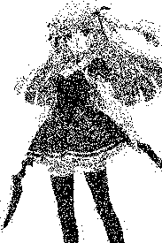
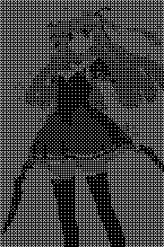

# TP noté Rust

# Partie 1

## Question 2 :

Ce type correspond à une énumération fournie par le package `image`. 
Elle liste tous les types d'images disponibles sur le package.

Pour obtenir une image RGB, il faut utiliser la méthode `.into_rgb8()`.

## Question 3 :

Le canal alpha est conservé si on enregistre l'image de sortie en PNG sauf si on utilise la méthode `.into_rgb8()` ou toute autre méthode qui convertit l'image en RGB.

## Question 4 :


## Question 5 :


# Partie 2

## Question 6 :

On utilise le type `Luma` avec la méthode `.to_luma()` récupérer la luminositée du pixel.

## Question 7 :

```rust
fn pixel_luminositer(img: &RgbImage, x: u32, y: u32) -> u8 {
    let pixel = img.get_pixel(x, y);
    let Luma(luminosite_) = pixel.to_luma();
    return luminosite_[0];
}
```
## Question 8 :


# Partie 3

## Question 9 :

## Méthode de calcul de la distance entre les couleurs

Pour appliquer la palette de couleurs à une image, chaque pixel est comparé à toutes les couleurs de la palette en utilisant la **distance euclidienne** dans l'espace des couleurs RGB. La distance entre deux couleurs RGB (R1, G1, B1) et (R2, G2, B2) est calculée comme suit :

$\text{distance}(C1, C2) = \sqrt{(R2 - R1)^2 + (G2 - G1)^2 + (B2 - B1)^2}$

Chaque pixel de l'image est remplacé par la couleur de la palette dont la distance est la plus faible.

## Question 10 :


## Question 11 :

Si la palette est vide, on renvoie une erreur de parametre.

# Partie 4

## Question 12 :




# Partie 5

## Question 13 :

$
B_3 = \frac{1}{64} \begin{pmatrix}
0 & 12 & 3 & 15 & 3 & 15 & 6 & 18 \\
8 & 4 & 11 & 7 & 11 & 7 & 14 & 10 \\
2 & 14 & 1 & 13 & 4 & 16 & 3 & 15 \\
10 & 6 & 9 & 5 & 13 & 9 & 12 & 8 \\
2 & 14 & 3 & 15 & 8 & 4 & 11 & 7 \\
14 & 10 & 13 & 9 & 15 & 11 & 14 & 10 \\
4 & 16 & 7 & 19 & 3 & 15 & 6 & 18 \\
12 & 8 & 11 & 7 & 13 & 9 & 14 & 10
\end{pmatrix}$

## Question 15 :




# Commandes de test

Crée une image en noir et blanc
```bash
cargo run -- src/images/images.jpeg src/images/output_noir_blanc.png bicolor
```

Crée une image avec deux couleurs choisie
```bash
cargo run -- src/images/images.jpeg src/images/output_deux_couleurs.png bicolor --couleurs Noir --couleurs Rouge
```

Crée une image avec une palette de couleurs
```bash
cargo run -- src/images/images.jpeg src/images/output_palette.png palette --n-couleurs 6 --couleurs Noir --couleurs Rouge --couleurs Vert --couleurs Blanc --couleurs Bleu --couleurs Magenta
```
Crée une image avec un tramage aléatoire
```bash
cargo run -- src/images/images.jpeg src/images/output_tramage_aleatoire.png tramage_aleatoire
```
Crée une image avec un tramage ordonné
```bash
cargo run -- src/images/images.jpeg src/images/output_ordered_dithering.png bayer --order 2
```
